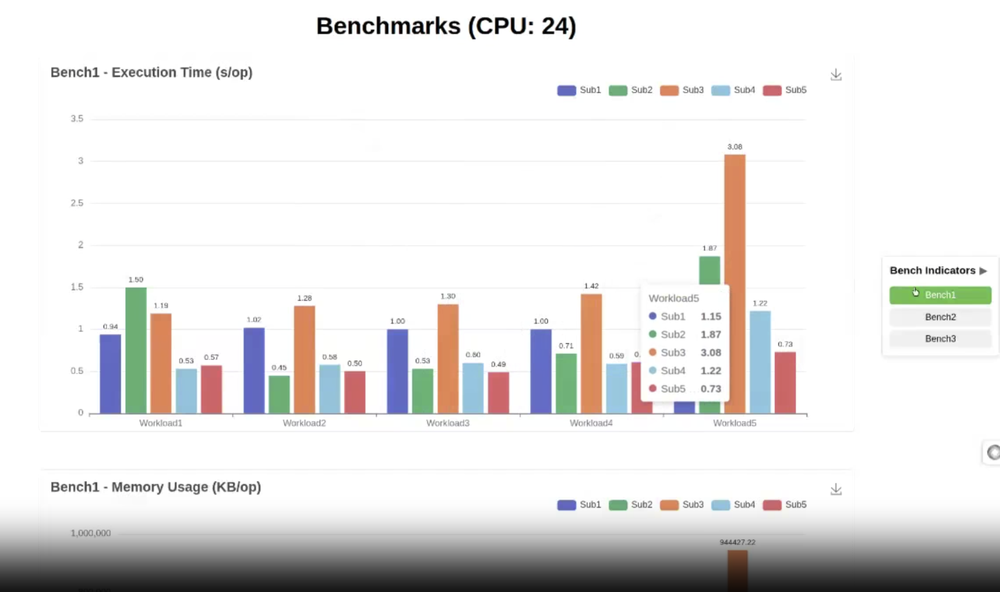

# Vizb - Go Benchmark Visualization Tool

[](https://goreportcard.com/report/github.com/goptics/vizb)
[](https://github.com/goptics/vizb/actions/workflows/ci.yml)
[](https://codecov.io/gh/goptics/vizb)
[](https://golang.org/doc/devel/release.html)
[](LICENSE)

Vizb is a CLI tool for visualizing Go benchmark results as interactive HTML charts. It helps you compare the performance of different implementations across various workloads.

## Features

- **Interactive Charts**: Generate beautiful, interactive HTML charts from Go benchmark results
- **Multiple Metrics**: Compare execution time, memory usage, and allocation counts
- **Customizable Units**: Display metrics in your preferred units (ns/ms/us for time, B/KB/MB/GB for memory)
- **Customizable Chart Title**: Set a custom name for your benchmark charts
- **Responsive Design**: Charts work well on any device or screen size
- **Export Capability**: Save charts as PNG images directly from the browser
- **Simple CLI Interface**: Easy-to-use command line interface with helpful flags
- **Piped Input Support**: Process benchmark data directly from stdin

## Overview varmq benchmark

https://github.com/user-attachments/assets/71830a61-76a5-4917-9bb6-7d06be0cc625

### The chart output

https://github.com/user-attachments/assets/5dad22b0-d21f-434f-ad6e-57f4ebc74981

## Installation

```bash
go install github.com/goptics/vizb
```

## Usage

### Basic Usage

1. Run your Go benchmarks with JSON output:

   ```bash
   go test -bench . -run=^$ -json > bench.json
   ```

   **Important**: The input must be a JSON file generated by the `go test -bench -json` command. The tool validates the JSON format and structure before processing.

1. Generate a chart from the benchmark results:

   ```bash
   vizb bench.json -o output.html
   ```

1. Open the generated HTML file in your browser to view the interactive charts.

### Piped Input

You can also pipe benchmark results directly to the tool:

```bash
go test -bench . -run=^$ -json | vizb -o output.html
```

### Command Line Options

```bash
Usage:
  vizb [target] [flags]

Arguments:
  target               Path to benchmark JSON file (optional if using piped input)

Flags:
  -h, --help                Help for vizb
  -n, --name string         Name of the chart (default "Benchmarks")
  -d, --description string  Description of the benchmark
  -o, --output string       Output HTML file name
  -f, --format string       Output format (html, json) (default "html")
  -s, --separator string    Separator for grouping benchmark names (default "/")
  -m, --mem-unit string     Memory unit available: b, B, KB, MB, GB (default "B")
  -t, --time-unit string    Time unit available: ns, us, ms, s (default "ns")
  -a, --alloc-unit string   Allocation unit available: K, M, B, T (default: as-is)

  -v, --version             Show version information
```

### Examples

#### Basic usage with file input

```bash
vizb bench.json
```

#### Pipe benchmark results directly

```bash
go test -bench . -run=^$ -json | vizb
```

#### Custom output file

```bash
vizb bench.json -o custom_chart.html
```

#### Generate JSON output instead of HTML

```bash
vizb bench.json -f json -o benchmark_results.json
```

#### Custom chart name and description

```bash
vizb bench.json -n "String Comparison Benchmarks" -d "Comparing different string manipulation algorithms"
```

#### Custom units for time and memory

```bash
vizb bench.json -t ms -m MB
```

#### Custom separator for benchmark grouping

```bash
vizb bench.json -s "_"
```

#### Show version information

```bash
vizb --version
```

## How vizb groups your bench scripts

Vizb organizes your benchmark results into groups based on a separator character. By default, this separator is `/`.

For example, if your benchmark is named `BenchmarkTest/workload/subject`, Vizb will group it as:

- BenchName: `Test`
- Workload: `workload`
- Subject: `subject`



You can change the separator using the `-s` or `--separator` flag:

```bash
vizb bench.json -s "_"
```

With this setting, a benchmark named `BenchmarkTest_workload_subject` would be grouped the same way.

Vizb always uses:

- The last part after the separator as the `subject` (`n - 1`)
- The second-to-last part as the `workload` (`n - 2`) (only if `n > 2`)
- The first part as the `Test` is considered as the name of the benchmark (`n - 3`)

here `n` is the number of word parts after the separation.

> [!Important]
> If `n < 3` means `BenchmarkTest_workload`, then the `test` is considered as the name of the benchmark and the `workload` is considered as the name of the `subject`.

In short, `workload` is only shows when the `n > 2`.

## Chart Types

Vizb generates three types of charts:

1. **Execution Time**: Shows the execution time per operation for each subject across different workloads
2. **Memory Usage**: Shows the memory usage per operation for each subject across different workloads
3. **Allocations**: Shows the number of memory allocations per operation for each subject

## Development

This project uses [Task](https://taskfile.dev/) for managing development workflows.

### Setup Development Environment

```bash
# Install Task runner
go install github.com/go-task/task/v3/cmd/task@latest

# Install required development tools
task setup
```

### Available Tasks

```bash
# List all available tasks
task

# Generate templates
task generate

# Build the binary
task build

# Run tests
task test
```

## Contributing

Contributions are welcome! Feel free to open issues or submit pull requests.

## License

This project is licensed under the MIT License - see the LICENSE file for details.

### Attribution

While not required by the MIT license, we kindly ask that you preserve the attribution footer in charts generated by Vizb when displaying them publicly.
