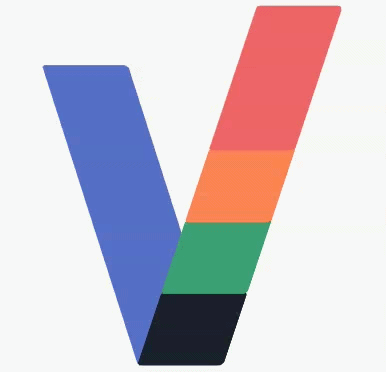

<div align="center">
<picture>
  <source media="(prefers-color-scheme: dark)" srcset="./assests/logo-dark.gif">
  
  <source media="(prefers-color-scheme: light)" srcset="./assests/logo-light.gif">
  
  
</picture>

  <h1>Vizb</h1>

  <p>
    <a href="https://github.com/avelino/awesome-go?tab=readme-ov-file#benchmarks"></a>
    <a href="https://vizb.goptics.org"></a>
    <a href="https://vizb.goptics.org/examples"></a>
    <a href="https://goreportcard.com/report/github.com/goptics/vizb"></a>
    <a href="https://github.com/goptics/vizb/actions/workflows/ci.yml"></a>
    <a href="https://codecov.io/gh/goptics/vizb"></a>
    <a href="https://github.com/goptics/vizb/releases"></a>
    <a href="https://golang.org/doc/devel/release.html"></a>
    <a href="LICENSE"></a>
  </p>

  <p>
    A CLI tool that turns benchmark output from <strong>Go</strong>, <strong>Rust</strong>, and <strong>JavaScript</strong> frameworks — or <strong>any tabular CSV/JSON data</strong> — into interactive <strong>4D visualizations</strong>. Pipe in results, apply multi-dimensional grouping, merge across runs, and explore everything in a single self-contained HTML file — no server, no dependencies, no build step. The input format is auto-detected, so <code>vizb data.csv</code> just works.
  </p>
</div>

## Installation

### Quick Install

```bash
# Linux / macOS
curl -fsSL https://vizb.goptics.org/install.sh | bash

# Windows
irm https://vizb.goptics.org/install.ps1 | iex
```

### Go Toolchain

```bash
go install github.com/goptics/vizb@latest
```

### Download Binary

Pre-built binaries for Linux, macOS, and Windows are available on the [releases page](https://github.com/goptics/vizb/releases).

## Documentation

Full documentation is available at **[vizb.goptics.org](https://vizb.goptics.org/)**:

- [Getting Started](https://vizb.goptics.org/getting-started/)
- [Parser Guide](https://vizb.goptics.org/guides/parsers/)
- [Tabular Data (CSV & JSON)](https://vizb.goptics.org/guides/data/)
- [Automatic Parser Detection](https://vizb.goptics.org/guides/auto-detection/)
- [CLI Commands](https://vizb.goptics.org/commands/root/)
- [Grouping Guide](https://vizb.goptics.org/guides/grouping/)
- [Merging Guide](https://vizb.goptics.org/guides/merging/)
- [CI/CD Integration](https://vizb.goptics.org/ci-cd/github-action/)

## Development

This project uses [Task](https://taskfile.dev/) for managing development workflows.

### Setup

```bash
go install github.com/go-task/task/v3/cmd/task@latest
task init
```

### Available Tasks

```bash
task dev:ui      # Run the UI in development mode
task dev:docs    # Run the docs site in development mode
task build:ui    # Build the UI
task build:cli   # Build the binary (run from ./bin/vizb)
task build:docs  # Build the docs for production
task build       # Build everything
task test        # Run tests
```

## Contributing

Contributions are welcome! Feel free to open issues or submit pull requests.

## License

This project is licensed under the MIT License — see the [LICENSE](LICENSE) file for details.
